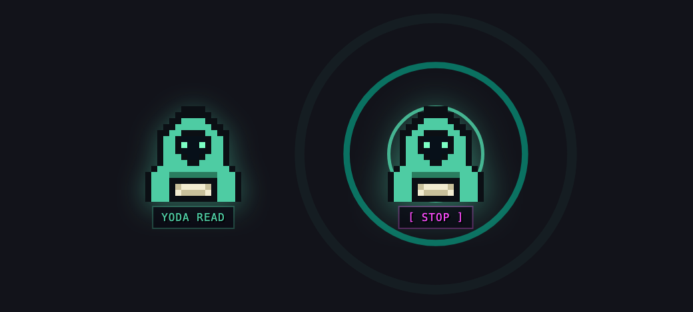
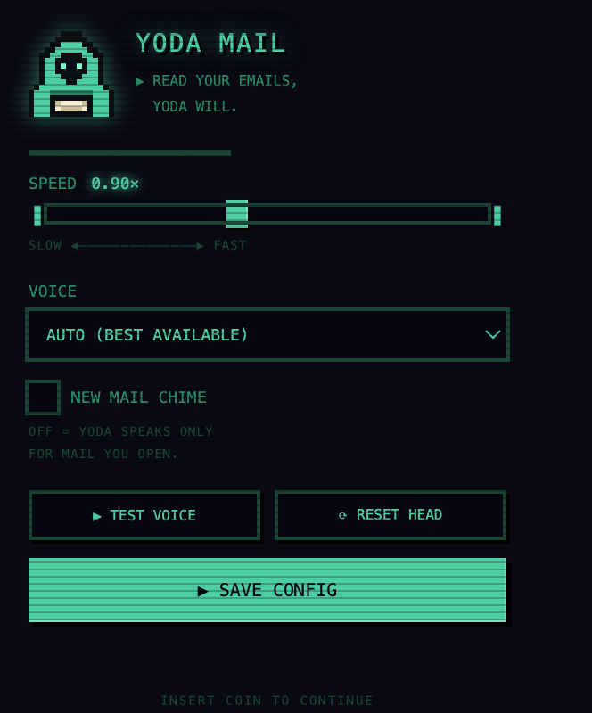

# Yoda Mail

**Read your emails, Yoda will.**

A small, silly Chrome extension that puts a floating hooded sage on Gmail. Click
it, and the email you have open is summarised, rewritten into Yoda's syntax, and
read aloud in a suitably ancient voice.



Everything happens inside your browser. There is no server, no API key, and no
network request of any kind — see [Privacy](#privacy).

---

## What it actually does

1. **Grabs the open email** — the visible message only, not the collapsed ones
   above it or the thread you were reading a minute ago.
2. **Throws away the noise** — quoted reply chains, forwarded headers, marketing
   footers, confidentiality notices, URLs, tracking links, "I hope you're well",
   "as per our conversation", and the sign-off block.
3. **Keeps what matters** — paragraphs are scored for deadlines, asks and dates,
   and the best few are kept in the email's own order, capped so a read lasts
   about forty seconds instead of five minutes.
4. **Inverts the grammar** — `We need to finalise the numbers by Friday` becomes
   *"Finalise the numbers by Friday, we must."*
5. **Speaks it** — in short chunks, with a pause/resume heartbeat, because Chrome
   quietly kills any single utterance longer than about fifteen seconds.

A real example, start to finish:

> **In:** Hi Akash, I hope you're doing well. I wanted to reach out about the Q3
> budget review. We need to finalise the numbers by Friday. Please confirm the
> headcount figures and approve the revised forecast before the board call.
> There is one open question on the marketing spend. Let me know if you disagree.
> Thanks, Priya

> **Out:** *About "Q3 budget review", this message is. Hmmmm. About the Q3 budget
> review. Finalise the numbers by Friday, we must. Confirm the headcount figures
> and approve the revised forecast before the board call, you must. One open
> question on the marketing spend, there is. Inform me if you disagree. Meditate
> on this, I will.*

---

## Install

Chrome extensions that are not on the Web Store are installed "unpacked". It
takes about thirty seconds.

**From a release (easiest)**

1. Download `yoda-mail-x.y.z.zip` from the
   [Releases](https://github.com/Dizzybot31/yoda-mail/releases) page and unzip it.
2. Open `chrome://extensions` and turn on **Developer mode** (top right).
3. Click **Load unpacked** and select the unzipped folder.
4. Open [Gmail](https://mail.google.com) and open any email. The head appears in
   the bottom-right corner.

**From source**

```bash
git clone https://github.com/Dizzybot31/yoda-mail.git
cd yoda-mail
npm run icons   # regenerates the pixel art (optional — it is committed)
```

Then load the folder with **Load unpacked**, as above.

> Chrome will show "Developer mode extensions" warnings on startup. That is
> Chrome's standard notice for anything installed outside the Web Store.

---

## Getting a properly ridiculous voice

Yoda Mail uses whatever speech voices your operating system has. Out of the box
it picks the best available, but the good ones are worth installing.

**macOS** — System Settings → Accessibility → Spoken Content → System Voice →
Manage Voices, then add **Superstar**, **Trinoids**, **Zarvox** or **Bad News**.
Restart Chrome afterwards. The extension prefers these automatically.

**Windows** — Settings → Time & Language → Speech → Manage voices. The stock
"Microsoft George" (en-GB) works well.

**Linux** — install `speech-dispatcher` with an espeak-ng backend.

Whatever you install, pick it explicitly in the popup and hit **TEST VOICE**.

---

## Settings

Click the extension icon in the toolbar.



| Setting | What it does |
| --- | --- |
| **SPEED** | Speech rate, 0.60×–1.30×. The pitch stays low regardless. |
| **VOICE** | Any voice your system has. ★ marks the ones Yoda Mail prefers. |
| **NEW MAIL CHIME** | Off by default. On, a chiptune plays when mail genuinely arrives. |
| **TEST VOICE** | Speaks a sample line so you can audition voices. |
| **RESET HEAD** | Drags the floating head back on screen if you lose it. |

The head is draggable — grab it and drop it anywhere. Its position is remembered
and clamped back inside the window if you resize. It is keyboard reachable too:
tab to it and press Enter.

---

## Privacy

Yoda Mail makes **no network requests at all**. It has no analytics, no API keys,
no remote fonts and no background service worker.

- Email text is read from the page, transformed in memory, and passed to your
  operating system's speech engine. It is never transmitted anywhere.
- The only stored data is your own settings (speed, voice, chime) and the head's
  position, via `chrome.storage`.
- Permissions are `storage` plus access to `mail.google.com` — nothing else.

---

## Development

```bash
npm test            # 28 unit tests over the text pipeline and mail watcher
npm run icons       # redraw the pixel art from the sprite in tools/generate-icons.js
npm run package     # build dist/yoda-mail-<version>.zip
```

The interesting code is deliberately DOM-free and unit tested:

| File | Responsibility |
| --- | --- |
| `src/text.js` | Cleaning, summarising and Yoda-ifying. Pure functions. |
| `src/speech.js` | Chrome's speech synthesis, and its many quirks. |
| `src/watcher.js` | Deciding whether mail actually arrived. |
| `src/fab.js` | The floating head, dragging, toasts. |
| `src/content.js` | Pulling the email out of Gmail, and the state machine. |
| `src/util.js` | `chrome.*` guards and viewport clamping. |

To change the mascot, edit the `SPRITE` grid at the top of
`tools/generate-icons.js` — it is a 16×16 character map — and run `npm run icons`.

---

## Known limits

- **Gmail's HTML is not an API.** The selectors used to find the open message
  (`.a3s`, `h2.hP`) are Gmail's internal class names and Google can change them
  without warning. If the head starts saying "OPEN AN EMAIL YOU MUST" on an open
  email, that is what happened — please open an issue.
- The summariser is regex and heuristics, not a language model. It is good at
  ordinary correspondence and poor at poetry, code and tables.
- Speech synthesis quality varies enormously between operating systems.
- English only.

---

## Disclaimer

This is an unofficial, non-commercial fan project. It is **not affiliated with,
endorsed by, or connected to Lucasfilm Ltd., The Walt Disney Company, or Google**.
"Yoda" and "Star Wars" are trademarks of Lucasfilm Ltd.; Gmail is a trademark of
Google LLC. No character artwork is used — the mascot is original pixel art drawn
by code in `tools/generate-icons.js`, and the character it depicts is a generic
hooded sage holding a letter.

## License

[MIT](LICENSE) © 2026 Akash Seth
